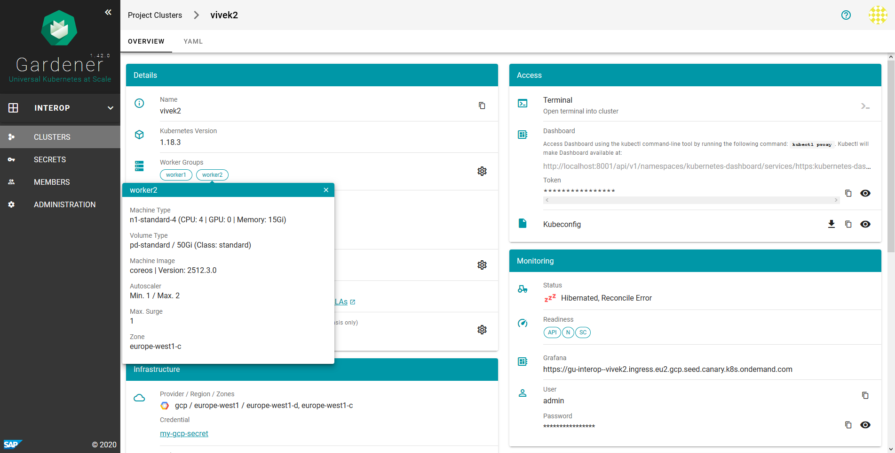

# Resource Aware Scheduler For Interoperator

This document describes the resource aware scheduler supported by interoperator. This is a feature as part of the [Label Selector based Scheduler](Interoperator.md#label-selector-based-scheduler). 

## Table of Content
- [Resource Aware Scheduler For Interoperator](#resource-aware-scheduler-for-interoperator)
  - [Table of Content](#table-of-content)
  - [Overview](#overview)
  - [Challenges](#challenges)
  - [Input from Service Operators/Service Owners](#input-from-service-operatorsservice-owners)
  - [Computing `totalCapacity` of Cluster](#computing-totalcapacity-of-cluster)
    - [Worker group 1](#worker-group-1)
    - [Worker group 2](#worker-group-2)
    - [Total for cluster](#total-for-cluster)

## Overview
* The service operators provides the resource `requests` for one service instance as part of `SFPlan`.
* The service operators optionally provides the `totalCapacity` of each cluster and part of `SFCluster`.
* Interoperator computes the current usage of resources for each cluster.
* Interoperator computes the `currentCapacity` of each cluster if `totalCapacity` is not provided.
* After label selector based filtering of clusters, clusters without required resources for the service instance are also filtered.
* Scheduler selects the Cluster with maximum allocatable resources (`capacity`- `requests`).

## Challenges
Gardener provides autoscaling groups of worker nodes. So the actual total capacity of a kubernetes cluster cannot be determined from the kubernetes api server alone. The info about auto scaling groups is available with gardner. The scheduler will need access to `Shoot` resource on the gardner seed cluster for this info. So in the initial proposal, it is decided to take the capacity as input instead of computing it. [Refer](https://kubernetes.io/docs/tasks/administer-cluster/cluster-management/#cluster-autoscaling)

All the scheduling decisions are based on resource `requests` of the pods created. If the `requests` and `limits` are not properly defined, the scheduling might lead to undesirable situations. [Refer](https://kubernetes.io/docs/concepts/configuration/manage-resources-containers/).

The current resource usage of a cluster is calculated by summing the current resource requests of all the pods. This might lead to situations where, even if the total allocatable resources available in a cluster is greater than the resource `requests` of a service instance, the instance may not be successfully deployed on the cluster. This can happen if none of the individual nodes have the requested resources. [Refer](https://kubernetes.io/docs/concepts/configuration/manage-resources-containers/).

Node affinity and anti-affinity are not considered by the scheduler. [Refer](https://kubernetes.io/docs/concepts/scheduling-eviction/assign-pod-node/).

## Input from Service Operators/Service Owners
Resource request for a service instance via `SFPlan`. This is added to `context` of `SFPlanSpec`. 
```
apiVersion: osb.servicefabrik.io/v1alpha1
kind: SFPlan
...
spec:
  ...
  context:
    requests:
      memory: 256Mi
      cpu: 1
  ...
```
Resource `requests` specifies the minimum resources required for one service instance. **Resource aware scheduling is applied only if this is provided**. If this is not provided, the scheduler selects the cluster based on the number of service instances. 

The `totalCapacity` of each cluster via `SFCluster`
```
apiVersion: resource.servicefabrik.io/v1alpha1
kind: SFCluster
metadata:
  name: "1"
spec:
  secretRef: shoot--postgresql-one
  totalCapacity:
    cpu: "14"
    memory: 52500Mi
```
This is a optional field. The `totalCapacity` is the total resource capacity of the cluster. It must account for the autoscaling of nodes also. If `totalCapacity` is not provided interoperator will use the `currentCapacity` of the cluster. The `currentCapacity` is the total allocatable resources from all the running nodes in the cluster. `currentCapacity` does not account for node autoscaling provided by gardener.

## Computing `totalCapacity` of Cluster
This example considers a kubernetes cluster provisioned by [Gardener](https://gardener.cloud/). Lets say the cluster has two worker groups with the following configurations

### Worker group 1
```
Machine Type: n1-standard-2 (CPU: 2 | GPU: 0 | Memory: 7500Mi)
Volume Type: pd-standard / 50Gi (Class: standard)
Machine Image: coreos | Version: 2512.3.0
Autoscaler: 
  Min: 1
  Max: 3
  Max Surge: 1
Zone: europe-west1-d 
```
Each node has a capacity of `2` cpu units and `7500Mi` memory. The autoscaler max value is `3`. So the total cpu capacity of the worker group is `6` (`2 * 3`) and total memory capacity is `22500Mi` (`7500Mi * 3`). The worker group configuration can be found from the gardener dashboard as follows:


### Worker group 2
```
Machine Type: n1-standard-4 (CPU: 4 | GPU: 0 | Memory: 15Gi)
Volume Type: pd-standard / 50Gi (Class: standard)
Machine Image: coreos | Version: 2512.3.0
Autoscaler:
  Min: 1
  Max: 2
  Max Surge: 1
Zone: europe-west1-c 
```
Each node has a capacity of `4` cpu units and `15Gi` memory. The autoscaler max value is `2`. So the total cpu capacity of the worker group is `8` (`4 * 2`) and total memory capacity is `30Gi` (`15Gi * 2`). The worker group configuration can be found from the gardener dashboard as follows:



### Total for cluster
The `totalCapacity` of the cluster will be:
* CPU: `14`  (cpu capacity of worker group 1 + cpu capacity of worker group 2 = `6 + 8`)
* Memory: `52500Mi` (memory capacity of worker group 1 + memory capacity of worker group 2 = `22500Mi + 30000Mi`)l.