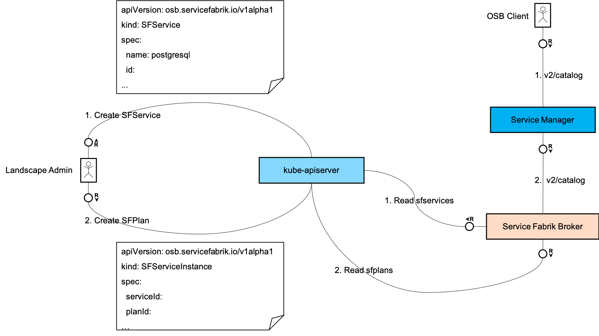
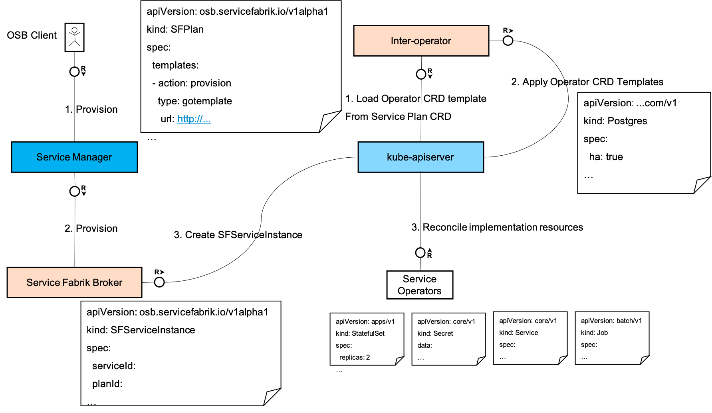
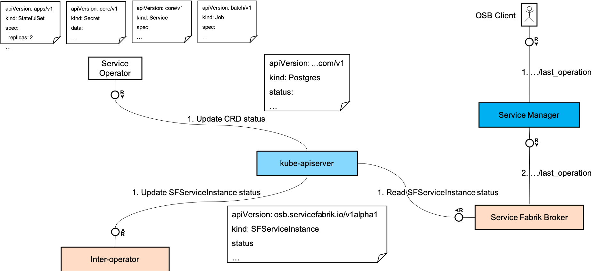

# Service Fabrik Inter-operator Basic Architecture

##  Abstract

This document describes the basic architecture and scope for the Service Fabrik inter-operator. This includes the details about how it integrates with [Service Manager](https://github.com/Peripli/service-manager) on the one side and with the individual service [operators](https://github.wdf.sap.corp/CPonK8s/k8s-native-services-concept/blob/master/README.md#packaging-inter-operability-and-discovery) on the other. This also includes some details about different possible kubernetes cluster landscapes for hosting the kubernetes-based services and how they can be managed.

## Target Audience

Architects, Developers, Product Owners, Development Managers who are interested in understanding/using Service Fabrik's inter-operator to expose Kubernetes-based services as [OSB](https://www.openservicebrokerapi.org/)-compliant service brokers and integrate with [Service Manager](https://github.com/Peripli/service-manager).

## Table of Content
* [Service Fabrik Inter\-operator Basic Architecture](#service-fabrik-inter-operator-basic-architecture)
  * [Abstract](#abstract)
  * [Target Audience](#target-audience)
  * [Table of Content](#table-of-content)
  * [Context](#context)
  * [Integration with Service Manager](#integration-with-service-manager)
    * [Service Fabrik Broker](#service-fabrik-broker)
    * [Service Fabrik Inter\-operator](#service-fabrik-inter-operator)
  * [Basic Control\-flow](#basic-control-flow)
    * [Catalog](#catalog)
      * [Service and Plan registration](#service-and-plan-registration)
      * [Service Fabrik Broker Catalog Cache](#service-fabrik-broker-catalog-cache)
      * [Integraton with Service Manager](#integraton-with-service-manager)
    * [Provision](#provision)
      * [Service Fabrik Broker](#service-fabrik-broker-1)
      * [Service Fabrik Inter\-operator](#service-fabrik-inter-operator-1)
      * [Service Operator](#service-operator)
    * [Last Operation](#last-operation)
      * [Service Operator](#service-operator-1)
      * [Service Fabrik Inter\-operator](#service-fabrik-inter-operator-2)
      * [Service Fabrik Broker](#service-fabrik-broker-2)
  * [Service Fabrik Inter\-operator Custom Resources](#service-fabrik-inter-operator-custom-resources)
    * [SFService](#sfservice)
    * [SFPlan](#sfplan)
      * [Templates](#templates)
        * [Template Variables](#template-variables)
        * [Actions](#actions)
        * [Types](#types)
        * [Remote Templates](#remote-templates)
        * [In\-line templates](#in-line-templates)
    * [SFServiceInstance](#sfserviceinstance)
      * [Rationale behind introducing the SFServiceInstance resource](#rationale-behind-introducing-the-sfserviceinstance-resource)
    * [SFServiceBinding](#sfservicebinding)

## Context

The technical guidelines for developing stateful services natively on Kubernetes are documented [here](https://github.wdf.sap.corp/CPonK8s/k8s-native-services-concept/blob/master/README.md).
The high-level approach recommendation is for the individual services to package their service implementation (including automated life-cycle activities) as a [Kubernetes Operator](https://github.wdf.sap.corp/CPonK8s/k8s-native-services-concept/blob/master/README.md#packaging-inter-operability-and-discovery).
An operator is a combination of a set of [custom resources](https://kubernetes.io/docs/concepts/extend-kubernetes/api-extension/custom-resources/) in Kubernetes and a set of custom controllers which watch, manage and implement a control-loop to take the required action to reconcile the desired state (as specified in the custom resources) with the actual state.

Typically, the operators are expected to manage their services within a given kubernetes cluster and be feature-complete (via their [custom resources](https://kubernetes.io/docs/concepts/extend-kubernetes/api-extension/custom-resources/) in the functionality they provide.

## Integration with Service Manager

[Service Manager](https://github.com/Peripli/service-manager) is a central repository of service brokers and platforms. It integrates with individual service brokers based on the [OSB](https://www.openservicebrokerapi.org/) API standard.

The guideline for developing stateful kubernetes-native services is to develop a [Kubernetes Operator](https://github.wdf.sap.corp/CPonK8s/k8s-native-services-concept/blob/master/README.md#packaging-inter-operability-and-discovery) for the service. This makes it very close to the paradigm of service development on kubernetes as provide a powerful way to encapsulate both service and life-cycle funcationality in once package.

This makes it necessary to bridge the gap between the Kubernetes [custom resource](https://kubernetes.io/docs/concepts/extend-kubernetes/api-extension/custom-resources/)-based API of the operators with the [OSB](https://www.openservicebrokerapi.org/) API expected by the [Service Manager](https://github.com/Peripli/service-manager).

The inter-operator proposes to bridge this gap using a metadata-based approach and avoid too much of coding for this integration. The following metadata needs to be captured for a given operator so that it can be integrated as an OSB-compatible Service Broker with ServiceManager.

1. OSB Service and Service Plans that are supported by the operator.
1. Templates of the Kubernetes [custom resources](https://kubernetes.io/docs/concepts/extend-kubernetes/api-extension/custom-resources/) of the operator.
1. Mapping of OSB actions such as `provision`, `deprovision`, `bind`, `unbind` etc. to the templated of Kubernetes [custom resources](https://kubernetes.io/docs/concepts/extend-kubernetes/api-extension/custom-resources/) of the operator.


### Service Fabrik Broker

The Service Fabrik Broker would act as the OSB API Adapter and is the component that intergrates with the Service Manager. It is a lean component that serves OSB API requests and records the requests in a set of OSB-equivalent custom resources [`SFServiceInstance`](#sfserviceinstance) and [`SFServiceBinding`](#sfservicebinding).

These custom resources capture all the data sent in their corresponding OSB requests and act as a point of co-ordination between the inter-operator component that would then work to reconcile these OSB resources with the actual operator [custom resources](https://kubernetes.io/docs/concepts/extend-kubernetes/api-extension/custom-resources/) based on the templates supplied in the catalog resources [`SFService`](#sfservice) and [`SFPlan`](#sfplan).

### Service Fabrik Inter-operator

The inter-operator is a [custom controller](https://kubernetes.io/docs/concepts/extend-kubernetes/api-extension/custom-resources/#custom-controllers) that keeps a watch on the [`SFServiceInstance`](#sfserviceinstance) and [`SFServiceBinding`](#sfservicebinding) custom resources and take the actions required as described [below]() to reconcile the corresponding resources of the service operator.

## Basic Control-flow

### Catalog



#### Service and Plan registration

The following steps are part of the landscape setup and a landscape administrator.
This could be an actual person or could be an automated component in itself.

1. Register `SFService` for the service.
There would be one `SFService` instance per service in the landscape.

It could be possible that a single Service Fabrik inter-operator serves multiple services in the same set of Kubernetes clusters. In such a case, there could be multiple `sfservices` registered for the same Service Fabrik inter-operator. But each of these `sfservices` would be for different individual services.

2. Register `sfplans` for each plan supported by the service.
As part of the away from t-shirt size approach to plans, it is recommended to minimize the number of plans per service. Ideally, that would be exactly one `SFPlan` per individual service.

Updates to the services and plans can be done as simple updates to the corresponding `sfservices` and `sfplans`. Service and plans can be unregistered by simply deleting the corresponding `sfservices` and `sfplans`.

TODO Backward compatibility existing instances must be handled by the individual service implemementations and the applications properly.

#### Service Fabrik Broker Catalog Cache

The Service Fabrik Broker watches for registered `sfservices` and `sfplans`. It reacts to registrations, updates and unregistrations and keeps an up-to-date representation of the information.

#### Integraton with Service Manager

1. An OSB client queries the [Service Manager](https://github.com/Peripli/service-manager) for a catalog of the available services via the `v2/catalog` request.
1. The Service Manager forwards this call (via some possible intermediaries) to the Service Fabrik Broker. 
1. The Service Fabrik Broker refers to its [internal up-to-date representation](#service-fabrik-broker-catalog-cache) and serves the catalog for the currently registered services.

### Provision

This section presumes that the `SFService` and `sfplans` are already registered as describe [above](#catalog).



#### Service Fabrik Broker

1. An OSB client makes a `provision` call to the [Service Manager](https://github.com/Peripli/service-manager).
1. The Service Manager forwards the call (perhaps via some intermediaries) to Service Fabrik Broker if the `provision` call was for a service and plan that was published by the Service Fabrik Broker.
The Service Manager adds some relevant additional context into the request.
1. The Service Fabrik Broker creates an `SFServiceInstance` capturing all the details passed in the the `provision` request from the Service Manager.
The Service Fabrik Broker returns an asynchronous response.

#### Service Fabrik Inter-operator

1. The inter-operator watches for `sfserviceinstances` and notices a newly created `SFServiceInstance`.
1. It loads the correct `provision` action template from the `SFPlan` corresponding to the `SFServiceInstance`.
1. It renders and applies the rendered template and creates the individual service's resources as specified in the template.

#### Service Operator

1. The individual service operator watches for its own Kubernetes API resources and notices a newly created set of resources.
1. It takes the required action to create the service instance.
1. It updates its Kubernetes API resources to reflect the status.

### Last Operation

This section presumes the following steps have already been performed.

1. `SFService` and `sfplans` are already registered as describe [above](#catalog).
1. A service instance is `provision`ed as described [above](#provision).



#### Service Operator

1. The individual service operator watches for its own Kubernetes API resources as well as all the lower level resources it has created to provision the service instance.
1. It notices a change in the status of any of the lower level resources and checks if the change in status is significant enough to be propagated to one of its own Kubernetes API resources.
1. It updates its corresponding Kubernest API resources.

#### Service Fabrik Inter-operator

1. The inter-operator watches for `sfserviceinstances` and the individual service operator's Kubernetes API resources (created using the `provision` template). It notices that some of the resources have been updated.
1. It uses the `status` template to extract the status information relevant to be propagated to the `SFServiceInstance`.
1. It updates the `SFServiceInstance`'s `status`.

#### Service Fabrik Broker

1. An OSB client makes a `last_operation` call to the [Service Manager](https://github.com/Peripli/service-manager).
1. The Service Manager forwards the call (perhaps via some intermediaries) to Service Fabrik Broker if the `provision` call was for a service instance that was provisioned by the Service Fabrik Broker.
The Service Manager adds some relevant additional context into the request.
1. The Service Fabrik Broker checks the `status` section of the `SFServiceInstance` and responds with the corresponding status.

## Service Fabrik Inter-operator Custom Resources

The following custom resources are introduced as part of the Service Fabrik inter-operator to integrate with [Service Manager](https://github.com/Peripli/service-manager) on the one side and with the individual service [operators](https://github.wdf.sap.corp/CPonK8s/k8s-native-services-concept/blob/master/README.md#packaging-inter-operability-and-discovery) on the other.

### SFService

The [`SFService`](../../config/crds/osb_v1alpha1_sfservice.yaml) captures the catalog/manifest details of an [`OSB Service`](https://github.com/openservicebrokerapi/servicebroker/blob/master/spec.md#service-offering-object) according to what is required to be served as part of the response for the `/v2/catalog` request.

For example,
```yaml
apiVersion: osb.servicefabrik.io/v1alpha1
kind: SFService
metadata:
  # Name maps to the name of the OSB Service.
  name: &id '24731fb8-7b84-5f57-914f-c3d55d793dd4'
spec:
  # Name of the OSB Service.
  name: &name postgresql

  # Id of the OSB Service.
  id: *id

  # Description of the OSB Service.
  description: &description 'Postgresql for internal development, testing, and documentation purposes of the Service Fabrik'

  # The following details map one-to-one with the data in the OSB service offering objects in the OSB /v2/catalog response.
  tags:
  - 'postgresql'
  requires: []
  bindable: true
  instanceRetrievable: true
  bindingRetrievable: true
  metadata:
    displayName: 'PostgreSQL'
    longDescription: *description
    providerDisplayName: 'SAP SE'
    documentationUrl: 'https://sap.com/'
    supportUrl: 'https://sap.com/'
  dashboardClient:
    id: postgresql-dashboard-client-id
    secret: postgresql-dashboard-client-secret
    redirectURI: 'https://sap.com/'
  planUpdatable: true
  context:
    serviceFabrik:
      backupEnabled: false
    operator:
      image: "servicefabrikjenkins/postgresql"
      tag: "latest"
      port: 8080

  # The following details are context input for Service Fabrik and the individual service operators.
  context:
    serviceFabrik:
      backupEnabled: false
    operator:
      image: "servicefabrikjenkins/blueprint"
      tag: "latest"
      port: 8080

```

The Service Fabrik Broker, as a [custom controller](https://kubernetes.io/docs/concepts/extend-kubernetes/api-extension/custom-resources/#custom-controllers), keeps a watch on `sfservices` and serves the subsequent `/v2/catalog` request according to the `sfservices` objects maintained as of the time of the request.

An operator can register one or more `sfservices`.

Deregistration of `sfservices` is handled using Kubernetes [finalizers](https://kubernetes.io/docs/tasks/access-kubernetes-api/custom-resources/custom-resource-definitions/#finalizers).

### SFPlan

The [`SFPlan`](../../config/crds/osb_v1alpha1_sfplan.yaml) captures the catalog/manifest details of an [`OSB Service Plan`](https://github.com/openservicebrokerapi/servicebroker/blob/master/spec.md#service-plan-object) according to what is required to be served as part of the response for the `/v2/catalog` request.

For example,
```yaml
apiVersion: osb.servicefabrik.io/v1alpha1
kind: SFPlan
metadata:
  # Name maps to the name of the OSB Service Plan.
  name: &id 29d7d4c8-6fe2-4c2a-a5ca-a826937d5a88
spec:
  # Name of the OSB Service Plan.
  name: &name 'v9.4-dev-large'

  # Id of the OSB Service Plan.
  id: *id

  # Description of the OSB Service Plan.
  description: 'Postgresql service running inside a k8s container (for non-productive usage)'

  # service_id of the OSB service to which this plan belongs.
  serviceId: '24731fb8-7b84-5f57-914f-c3d55d793dd4'

  # schemas describe the schema for the supported parameter for the provision and bind OSB actions.
  schemas:
    service_instance:
      create:
        parameters:
          "$schema": "http://json-schema.org/draft-06/schema#"
          title: createServiceInstance
          type: object
          additionalProperties: false
          properties:
            foo:
              type: string
              description: some description for foo field
          required:
          - "foo"

  # The following details map one-to-one with the data in the OSB service plan objects in the OSB /v2/catalog response.
  metadata:
    service-inventory-key: SERVICE-161
    costs:
    - amount:
        usd: 0.0
      unit: 'MONTHLY'
    bullets:
    - 'Container Deployment'
    - '128 MB Memory'
    - '100 MB Disk'
  free: true
  bindable: true
  planUpdatable: false

  # This section is configuration for to the operator and Service Fabrik.
  manager:
    async: true
  context:
    operator:
      image: "servicefabrikjenkins/blueprint"
      tag: "latest"
      port: 8080
      memory: '128m'
      persistent_volumes:
      - name: 'data'
        path: '/data'
        size: '100m'
    serviceFabrik:
      backupEnabled: false

  # templates map the OSB actions to the templates of the custom resources of the operator.
  templates:
  - action: provision
    type: gotemplate
    content: |-
      {{- $name := "" }}
      {{- with .instance.metadata.name }} {{ $name = . }} {{ end }}
      apiVersion: kubedb.com/v1alpha1
      kind: Postgres
      metadata:
      name: kdb-{{ $name }}-pg
      spec:
        version: 10.2-v1
        storageType: Durable
        storage:
          storageClassName: default
          accessModes:
          - ReadWriteOnce
          resources:
            requests:
              storage: 50Mi
        terminationPolicy: WipeOut

```

The Service Fabrik Broker, as a [custom controller](https://kubernetes.io/docs/concepts/extend-kubernetes/api-extension/custom-resources/#custom-controllers),
keeps a watch on `sfplans` and serves the subsequent `/v2/catalog` request according to the `sfplanss` objects maintained as of the time of the request.

An operator can register one or more `sfplans`.

Deregistration of `sfplans` is handled using Kubernetes [finalizers](https://kubernetes.io/docs/tasks/access-kubernetes-api/custom-resources/custom-resource-definitions/#finalizers).

#### Templates

Service Fabrik inter-operator, currently, assumes that API of the individual service's operator would be Kubernetes Resources.
Service Fabrik inter-operator does not make any assumptions about the individual service operator's API apart from this.
Usually, they would be some [custom resources](https://kubernetes.io/docs/concepts/extend-kubernetes/api-extension/custom-resources/),
which would give the service operator implementation the full flexibility to implement and expose their functionality.

To enable this independence of API for the service operators, Service Fabrik inter-operator relies on the templates supplied in the [`sfplans`](#sfplan) to map the OSB actions to the specific CRDs or the individual service operators.

##### Template Variables

To provide the flexibility to the individual service implementations, many standard template variables are supplied during the rendering of the templates.

At a minimum, the following variable would be supported.
1. `SFService`.
1. `SFPlan`.
1. `SFInstance`.
1. `SFBind` for `bind` request.

More variables such as the actual resources created by the template might also be made available in the future.

##### Actions

The `action` field can be used to specify the OSB action for which the template supplied is applicable. Typically, these would include `provision`, `bind` etc. But these could be extended to custom/generic actions.

##### Types

The `type` field can be used to specify the type of template itself. For example, [`gotemplate`](https://golang.org/pkg/text/template/), [`helm`](https://helm.sh/) etc. In future, additional template types could be supported such as [`jsonnet`](https://jsonnet.org/).

Currently, only a single resource is expected to be generated by the `gotemplates`. The type `helm` supports the generation of multiple resources.

##### Remote Templates

The `url` field can be used to specify the location where the actual templates can be found. For example,

```yaml
apiVersion: osb.servicefabrik.io/v1alpha1
kind: SFPlan
spec:
  templates:
  - action: provision
    type: gotemplate
    url: "https://raw.githubusercontent.com/cloudfoundry-incubator/service-fabrik-broker/feature/inter-operator/interoperator/config/samples/templates/gotemplates/postgres/postgres.yaml"
```

Please note that the URLs have to be accessible for the Service Fabrik inter-operator. This is especially relevent in the private cloud scenario.

##### In-line templates

Since service operators are expected to [feature-complete](#context) in their API, it would be very common scenario that an OSB action maps to a single (possibly the same) Kubernetes resource of the service operator.
The template type `gotemplate` fits this use-case well.
This common use-case can be easily implemented by using the `content` field to specify the `gotemplate` content directly in-line in the `SFPlan` rather than referring to it in a remote location using the `url` field (which is also possible).

For example,

```yaml
apiVersion: osb.servicefabrik.io/v1alpha1
kind: SFPlan
spec:
templates:
  - action: provision
    type: gotemplate
    content: |-
      {{- $name := "" }}
      {{- with .instance.metadata.name }} {{ $name = . }} {{ end }}
      apiVersion: kubedb.com/v1alpha1
      kind: Postgres
      metadata:
      name: kdb-{{ $name }}-pg
      spec:
        version: 10.2-v1
        storageType: Durable
        storage:
          storageClassName: default
          accessModes:
          - ReadWriteOnce
          resources:
            requests:
              storage: 50Mi
        terminationPolicy: WipeOut
```

### SFServiceInstance

The [`SFServiceInstance`](../../config/crds/osb_v1alpha1_sfserviceinstance.yaml) captures all the details from an OSB `provision` request.

For example,
```yaml
apiVersion: osb.servicefabrik.io/v1alpha1
kind: SFServiceInstance
metadata:
  # Name would map to the instance_id from the OSB provision request.
  name: '0304b210-fcfd-11e8-a31b-b6001f10c97f'
spec:
  # service_id as in the OSB provision request.
  serviceId: '24731fb8-7b84-5f57-914f-c3d55d793dd4'

  # plan_id as in the OSB provision request.
  planId: '29d7d4c8-6fe2-4c2a-a5ca-a826937d5a88'

  # context contains all the data that is passed as part of the context in the OSB provision request.
  context:
    organizationGuid: organization-guid
    spaceGuid: space-guid

  # parameters as passed to the OSB provision request.
  parameters:

# status would be updated by the inter-operator.
status:
  state:
  dashboardUrl:

```

The inter-operator as a [custom controller](https://kubernetes.io/docs/concepts/extend-kubernetes/api-extension/custom-resources/#custom-controllers) that keeps a watch on `sfserviceinstances` and take action as described [below]() to reconcile the actual operator [custom resources](https://kubernetes.io/docs/concepts/extend-kubernetes/api-extension/custom-resources/).

`Deprovision` is handled using Kubernetes [finalizers](https://kubernetes.io/docs/tasks/access-kubernetes-api/custom-resources/custom-resource-definitions/#finalizers).

#### Rationale behind introducing the `SFServiceInstance` resource

Technically, the functionality of the Service Fabrik inter-operator can be implemented without using the `SFServiceInstance` resource for simpler use-cases.
For example, in the [`provision`] control-flow, the Service Fabrik Broker can directly lookup the [`SFPlan`] and apply the right template and create the actual service-specific resources directly without having to create an intermediate `SFServiceIntance` resource first to be picked up by the `Service Fabrik inter-operator.
This might work well for the scenario where the Service Fabrik in provisioned on the same Kubernetes cluster as where the service operator and it's instances are also eventually provisioned.
But as discussed in the [cluster landscape document](cluster-landscape.md), there are [reasons](cluster-landscape.md#tree-dimensions-for-comparison) to [recommend](cluster-landscape.md#recommended-landscape-scenario) more dynamic scenarios involving multiple Kubernetes clusters where the Kubernetes cluster where Service Fabrik is provisioned would be different from the Kubernetes cluster where the service operator and the instances are provisioned.
This would lead to a [design](cluster-landscape.md#service-instance-scheduling) where there a scheduler to provide loose coupling between the scheduling decision (in which Kubernetes cluster a particular service instance is to be provisioned) and the actual details of provisioning.
Such a design would necessitate two sets of custom resources.
1. One resource on the Service Fabrik side on which the scheduling decision can be take an recorded.
1. Another resource (or set of resources) which are to be acted upon by the service operator.

In such a scenario, it makes sense to leverage the first resource on the Service Fabrik side to record the OSB request almost verbatim which leads to the current `SFServiceInstance` design.

### SFServiceBinding

The [`SFServiceBinding`](../../config/crds/osb_v1alpha1_sfservicebinding.yaml) captures all the details from an OSB `bind` request.

For example,
```yaml
apiVersion: osb.servicefabrik.io/v1alpha1
kind: SFServiceBinding
metadata:
  # Name would map to the binding_id from the OSB bind request.
  name: 'de3dd272-fcfc-11e8-a31b-b6001f10c97f'
spec:
  # instance_id as in the OSB bind request.
  instanceId: 0304b210-fcfd-11e8-a31b-b6001f10c97f

  # service_id as in the OSB bind request.
  serviceId: '24731fb8-7b84-5f57-914f-c3d55d793dd4'

  # plan_id as in the OSB bind request.
  planId: '29d7d4c8-6fe2-4c2a-a5ca-a826937d5a88'

  # bind_resource as in the OSB bind request.
  bindResource:

  # context contains all the data that is passed as part of the context in the OSB bind request.
  context:
    organizationGuid: organization-guid
    spaceGuid: space-guid

  # parameters as passed to the OSB bind request.
  parameters:
  
status:
  state:

```

The inter-operator as a [custom controller](https://kubernetes.io/docs/concepts/extend-kubernetes/api-extension/custom-resources/#custom-controllers) that keeps a watch on `sfservicebindings` and take action as described [below]() to reconcile the actual operator [custom resources](https://kubernetes.io/docs/concepts/extend-kubernetes/api-extension/custom-resources/).

`Unbind` is handled using Kubernetes [finalizers](https://kubernetes.io/docs/tasks/access-kubernetes-api/custom-resources/custom-resource-definitions/#finalizers).
