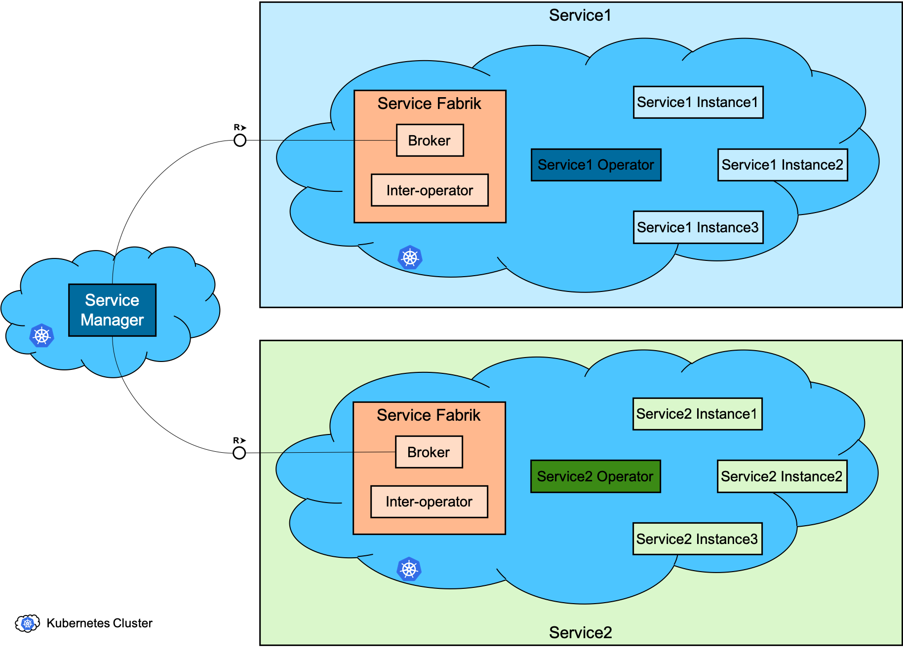
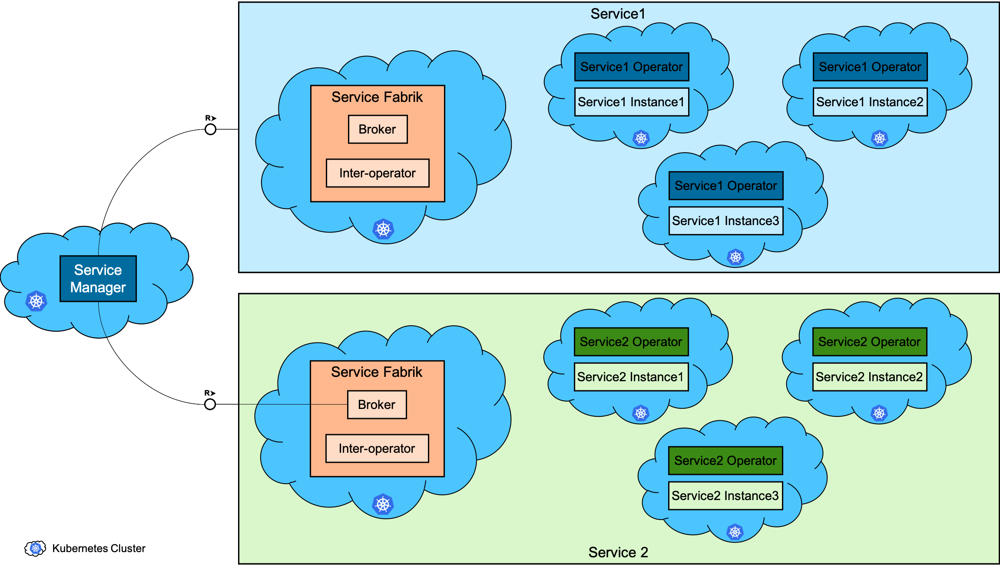
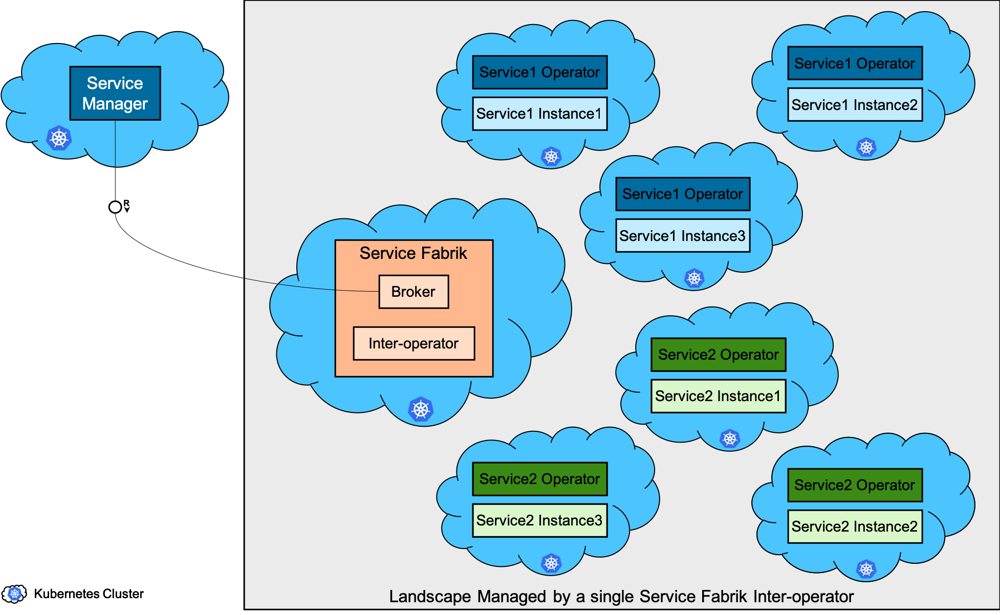
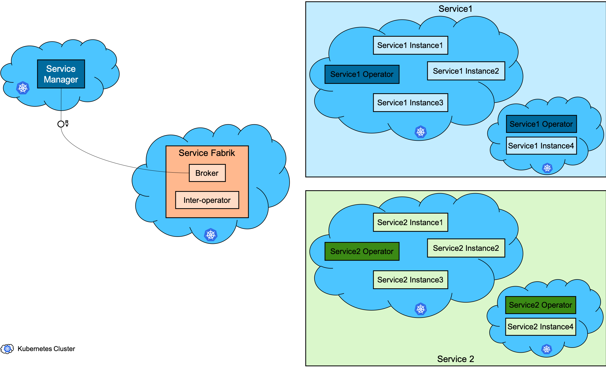

# Service Fabrik Inter-operator Cluster Landscape Architecture

##  Abstract

This document describes the cluster landscape aspect of the architecture and scope of the Service Fabrik inter-operator.
This includes not only the architectural approach to handle the different possible cluster landscapes but also the details about the different landscape scenarios (such as a dedicated v/s shared cluster landscape) and also some rationale for the landscape scenarios as well as the way they influence the architectural approach.

## Target Audience

Architects, Developers, Product Owners, Development Managers who are interested in understanding/using Service Fabrik's inter-operator to expose Kubernetes-based services as [OSB](https://www.openservicebrokerapi.org/)-compliant service brokers and integrate with [Service Manager](https://github.com/Peripli/service-manager).

## Table of Content
* [Service Fabrik Inter\-operator Cluster Landscape Architecture](#service-fabrik-inter-operator-cluster-landscape-architecture)
  * [Abstract](#abstract)
  * [Target Audience](#target-audience)
  * [Table of Content](#table-of-content)
  * [Context](#context)
  * [Cluster Landscape Scenarios](#cluster-landscape-scenarios)
    * [A Summary of Comparison of Cluster Landscape Scenarios](#a-summary-of-comparison-of-cluster-landscape-scenarios)
      * [Scalability](#scalability)
      * [Networking Complexity](#networking-complexity)
      * [Security Isolation](#security-isolation)
      * [Resource Utilization](#resource-utilization)
      * [Cluster Topology](#cluster-topology)
      * [Cluster Maintenance](#cluster-maintenance)
      * [Cluster Disposability](#cluster-disposability)
      * [SLA](#sla)
      * [Cross\-platform Consumption](#cross-platform-consumption)
    * [Dedicated Service Fabrik Inter\-operator](#dedicated-service-fabrik-inter-operator)
      * [A simple dedicated landscape scenario](#a-simple-dedicated-landscape-scenario)
        * [Pros](#pros)
        * [Cons](#cons)
      * [A conservative dedicated landscape scenario](#a-conservative-dedicated-landscape-scenario)
        * [Pros](#pros-1)
        * [Cons](#cons-1)
      * [An optimal dedicated landscape scenario](#an-optimal-dedicated-landscape-scenario)
        * [Pros](#pros-2)
        * [Cons](#cons-2)
    * [Shared Service Fabrik Inter\-operator](#shared-service-fabrik-inter-operator)
      * [A simple shared landscape scenario](#a-simple-shared-landscape-scenario)
        * [Pros](#pros-3)
        * [Cons](#cons-3)
      * [A conservative shared landscape scenario](#a-conservative-shared-landscape-scenario)
        * [Pros](#pros-4)
        * [Cons](#cons-4)
      * [An optimal shared landscape scenario](#an-optimal-shared-landscape-scenario)
        * [Pros](#pros-5)
        * [Cons](#cons-5)
    * [Hybrid Landscape Scenario](#hybrid-landscape-scenario)
      * [Pros](#pros-6)
      * [Cons](#cons-6)
    * [Customer Specific Landscape Scenario](#customer-specific-landscape-scenario)
      * [Pros](#pros-7)
      * [Cons](#cons-7)
    * [Four Dimensions for Comparison](#four-dimensions-for-comparison)
      * [One Cluster vs\. Multiple Clusters](#one-cluster-vs-multiple-clusters)
      * [Dedicated Clusters vs\. Shared Clusters](#dedicated-clusters-vs-shared-clusters)
      * [Degrees of isolation](#degrees-of-isolation)
      * [Customer Specificity](#customer-specificity)
    * [Recommended Landscape Scenario](#recommended-landscape-scenario)
  * [Managing the Cluster Landscape](#managing-the-cluster-landscape)
    * [An analogy to kube\-scheduler](#an-analogy-to-kube-scheduler)
    * [Service Instance Scheduling](#service-instance-scheduling)
    * [A point to note about Service Instance Scheduling](#a-point-to-note-about-service-instance-scheduling)

## Context

The [context](basic.md#context) mentioned in the [basic architecture](basic.md) is applicable here.

In addition to the above context, continuing the [operator design-pattern](https://github.wdf.sap.corp/CPonK8s/k8s-native-services-concept/blob/master/README.md#high-level-design-pattern) in Kubernetes, the individual service operators are expected to manage the service instances within a Kubernetes cluster.
This leaves the responsibility for setting up and managing the landscape of Kubernetes clusters where the individual service operators provision and manage their services instances out of the scope of the individual service operators.

## Cluster Landscape Scenarios

### A Summary of Comparison of Cluster Landscape Scenarios

| Sl. No. | Cluster Landscape Scenario | [Scalability](#scalability) | [Networking Complexity](#networking-complexity) | [Security Isolation](#security-isolation) | [Resource Utilization](#resource-utilization) | [Cluster Topology](#cluster-topology) | [Cluster Maintenance](#cluster-maintenance) | [Cluster Disposability](#cluster-disposability) | [SLA](#sla) | [Cross-platform Consumption](#cross-platform-consumption) |
| ---:| --- | ---| --- | --- | --- | --- | --- | --- | --- | --- |
| 1 | [Single Dedicated Cluster per Service Type](#a-simple-dedicated-landscape-scenario) | Limited to the hosting cluster | Complex | High with [proper mitigation](https://github.wdf.sap.corp/CPonK8s/k8s-native-services-concept/blob/master/README.md#security) | High | Easy to enforce | Independently manageable | Low | Possible | Possible |
| 2 | [Conservative Dedicated Clusters per Service Type](#a-conservative-dedicated-landscape-scenario) | Unlimited | Complex | High | Low | Easy to enforce | Independently manageable | High | Possible | Possible |
| 3 | [Optimal Dedicated Clusters per Service Type](#an-optimal-dedicated-landscape-scenario) | Unlimited | Complex | High with [proper mitigation](https://github.wdf.sap.corp/CPonK8s/k8s-native-services-concept/blob/master/README.md#security) | High | Easy to enforce | Independently manageable | Possibly high | Possible | Possible |
| 4 | [Single Shared Cluster](#a-simple-shared-landscape-scenario) | Limited to the hosting cluster | Complex | High with [proper mitigation](https://github.wdf.sap.corp/CPonK8s/k8s-native-services-concept/blob/master/README.md#security) | High | Enforcing requires co-ordination between service types | Requires co-ordination between service types | Low | Possible | Possible |
| 5 | [Conservative Shared Clusters](#a-conservative-shared-landscape-scenario) | Unlimited | Complex | High | Low | Easy to enforce | Independently manageable | High | Possible | Possible |
| 6 | [Optimal Shared Clusters](#an-optimal-shared-landscape-scenario) | Unlimited | Complex | High with [proper mitigation](https://github.wdf.sap.corp/CPonK8s/k8s-native-services-concept/blob/master/README.md#security) | High | Enforcing requires co-ordination between service types | Requires co-ordination between service types | Possibly high | Possible | Possible |
| 7 | Service instance provisioned in the Consuming Cluster | Limited to the hosting cluster but the need for scalability might be less | Simple | High with [proper mitigation](https://github.wdf.sap.corp/CPonK8s/k8s-native-services-concept/blob/master/README.md#security) and security isolation requirement might be less | High | Hard to enforce | Requires co-ordination between the services and apps running in the hosting cluster | Low | Hard because of admin access to the cluster for the consumer | Restricted to Kubernetes |
| 8 | Single Dedicated Cluster per Customer per Service Type | Limited to the hosting cluster but the need for scalability might be less | Potentially simple | High with [proper mitigation](https://github.wdf.sap.corp/CPonK8s/k8s-native-services-concept/blob/master/README.md#security) and security isolation requirement might be less | High if there are a large number of service instances of a given service type for a given customer | Easy to enforce | Independently manageable | Possibly high depending on the number of service instances | Possible | Possible |
| 9 | Conservative Dedicated Clusters per Customer per Service Type | Unlimited | Potentially simple | High | Low | Easy to enforce | Independently manageable | High | Possible | Possible |
| 10 | Optimal Dedicated Clusters per Customer per Service Type | Unlimited | Potentially simple | High with [proper mitigation](https://github.wdf.sap.corp/CPonK8s/k8s-native-services-concept/blob/master/README.md#security) | High if there are a large number of service instances of a given service type for a given customer | Easy to enforce | Independently manageable | Possibly high | Possible | Possible |
| 11 | Single Dedicated Cluster per Customer but shared among Service Types | Limited to the hosting cluster but the need for scalability might be less | Potentially simple | High with [proper mitigation](https://github.wdf.sap.corp/CPonK8s/k8s-native-services-concept/blob/master/README.md#security) and security isolation requirement might be less | High if there are a large number of service instances for the customer | Enforcing requires co-ordination between service types | Requires co-ordination between service types | Possibly high depending on the number of service instances | Possible | Possible |
| 12 | Optimal Dedicated Cluster per Customer but shared among Service Types | Unlimited | Potentially simple | High with [proper mitigation](https://github.wdf.sap.corp/CPonK8s/k8s-native-services-concept/blob/master/README.md#security) and security isolation requirement might be less | High if there are a large number of service instances for the customer | Enforcing requires co-ordination between service types | Requires co-ordination between service types | Possibly high depending on the number of service instances | Possible | Possible |

#### Scalability

Scalability of both the individual service instances as well as, if applicable, the number of service instances in a landscape.

#### Networking Complexity

The complexity of setting up the network access between the consuming application and the service instance.

#### Security Isolation

The isolation between the service instances. If applicable, between service instances of different customers.
This could be at different levels such as the Kubernetes API, network access and node or operating system level.

#### Resource Utilization

Utilization of resources such as nodes/machines or even at a lower granularity of CPU, memory, disk, network bandwidth etc.

#### Cluster Topology

Individual services might require different types and quantity of machines, hardware resources also multiple availability zones etc.
Such requriements might vary from service to service.

#### Cluster Maintenance

Maintenance activity on the hosting Kubernetes cluster might have to be co-ordinated with the applications and services running on the Kubernetes cluster.
The dependencies of different services and applications on different features and hence, the version of Kubernetes might complicate things more.

#### Cluster Disposability

1. How easy is to move a service instance from one cluster to another?
1. How easy is it to migrate all services of a cluster to another?
1. How easy is it to recover from a cluster failure?

#### SLA

Service Level Agreements might require some sort of control over changes made to the service instances.
Or at least some mitigation in terms of granular audit logging.

#### Cross-platform Consumption

Some scenarios might be more amenable for hosting service instances on Kubernetes to be consumed from platforms other than Kubernetes and some less.

### Dedicated Service Fabrik Inter-operator

In this scenario, an individual service operator would provision and configure a dedicated Service Fabrik inter-operator for its own purposes of integrating its landscape of service instances on Kubernetes clusters via the [Service Manager](https://github.com/Peripli/service-manager).

#### A simple dedicated landscape scenario

A simple scenario for a dedicated inter-operator could be depicted as below.
.

* Each service gets its own dedicated Kubernetes cluster to host its service operator and its service instances.
* Each service provisions and configured its own instance of Service Fabrik inter-operator. This is in the same cluster where the service operator and the service instances are hosted.
* The different dedicated Service Fabrik Brokers for the different individual services are registered with the Service Manager.

##### Pros
* The landscape is simple.
* Better isolation between different kinds of services.
* The Kubernetes cluster is dedicated for the individual service and its instances.
  * Less operational overhead.
  * The cluster can be tuned and configured to be optimal for the needs of the service and its instances.
* The Service Fabrik inter-operator is dedicated for the individual service and its instances.
  * Less operation overhead.
  * The inter-operator can be configured to be optimal for the needs of the service and its instances.

##### Cons
* Service instances are still running on a single Kubernetes cluster.
  * Service implementation and the cluster configuration must be strengthened to ensure good isolation from the perspective of both [security](https://github.wdf.sap.corp/CPonK8s/k8s-native-services-concept/blob/master/README.md#security) and [performance](https://github.wdf.sap.corp/CPonK8s/k8s-native-services-concept/blob/master/README.md#performance).
* Scale is coupled to the scale of the host Kubernetes cluster.
  * There are limits to the size of workable Kubernetes clusters and this size limit will, in turn, limit the number and scale of the service instances hosted on that cluster.

#### A conservative dedicated landscape scenario

As one way of addressing the isolation [issues](#cons) in the [simple landscape scenario](#a-simple-dedicated-landscape-scenario), one can think of a conservative landscape as depicted below.

.

##### Pros

* Service instances are running in a dedicated Kubernetes cluster. This reduces the isolation concerns from the security and performance perspective.
* The number of service instances per landscape as well as the scale of the individual service instances is not limited by the architecture and the landscape.
* The Kubernetes cluster is dedicated for the individual service and its instances.
  * Moderate operational overhead.
  * The clusters can be tuned and configured to be optimal for the needs of the service and its instances.
* The Service Fabrik inter-operator is dedicated for the individual service and its instances.
  * Less operation overhead.
  * The inter-operator can be configured to be optimal for the needs of the service and its instances.

##### Cons

* The cluster landscape is more complex.
* Mapping of a service instance to its hosting Kubernetes Cluster is one-to-one.
* Sub-optimal resource utilization. Kubernetes control-plane becomes an overhead for each service instance.
* The number of Kubernetes cluster in the landscape becomes very large, requiring further keeping track and management of those Kubernetes clusters.

#### An optimal dedicated landscape scenario

Due to the [limitations](#cons) of the [simple landscape scenario](#a-simple-dedicated-landscape-scenario) as well as [those](#cons-1) of the [conservative landscape scenario]((#a-conservative-dedicated-landscape-scenario), one can think of a more optimal landscape as depicted below.

.

##### Pros

* More optimal resource-utilization. Many service instances are hosted on any given Kubernetes cluster. This distributes the usage of the Kubernetes control-plane across multiple service instances.
* The number of service instances in the landscape as well as the scale of the individual service instances is not limited by the architecture and the landscape.
* The Kubernetes clusters are dedicated for the individual service and its instances.
  * Moderate operational overhead.
  * The clusters can be tuned and configured to be optimal for the needs of the service and its instances.
* The Service Fabrik inter-operator is dedicated for the individual service and its instances.
  * Less operation overhead.
  * The inter-operator can be configured to be optimal for the needs of the service and its instances.

##### Cons

* The cluster landscape is more complex.
* Mapping of a service instance to its hosting Kubernetes Cluster is many-to-many.
* Multiple service instances are still running in any given Kubernetes cluster.
  * Service implementation and the cluster configuration must be strengthened to ensure good isolation from the perspective of both [security](https://github.wdf.sap.corp/CPonK8s/k8s-native-services-concept/blob/master/README.md#security) and [performance](https://github.wdf.sap.corp/CPonK8s/k8s-native-services-concept/blob/master/README.md#performance).

### Shared Service Fabrik Inter-operator

In this scenario, an individual service operator would use and configure a Service Fabrik inter-operator that is shared with other services for integrating its landscape of service instances on Kubernetes clusters via the [Service Manager](https://github.com/Peripli/service-manager).

#### A simple shared landscape scenario

A simple scenario for a shared inter-operator could be depicted as below.
.

* A single Kubernetes cluster might host the service operator and service instances of multiple services.
* A single instance of Service Fabrik inter-operator might be shared by multiple services.
* Each service will configure the same Service Fabrik inter-operator for its own purpose of integrating its landscape of service instances on Kubernetes clusters via the [Service Manager](https://github.com/Peripli/service-manager).
This is in the same cluster where the service operator and the service instances are hosted.
* The Service Fabrik Broker that is shared between the different individual services is registered with the Service Manager.

##### Pros
* The landscape is simple.
* The isolation between different kinds of services is pretty much the same as between the different instances of the same service.

##### Cons
* The Kubernetes cluster is shared for multiple services and their instances.
  * More operational overhead as it is difficult to co-ordinate between teams managing the different services.
  * It is difficult to tune the cluster and configure it to be optimal for the needs of the different service and their instances.
* The Service Fabrik inter-operator is shared between the different services and their instances.
  * More operational overhead.
* Service instances are running on a single Kubernetes cluster.
  * Service implementation and the cluster configuration must be strengthened to ensure good isolation from the perspective of both [security](https://github.wdf.sap.corp/CPonK8s/k8s-native-services-concept/blob/master/README.md#security) and [performance](https://github.wdf.sap.corp/CPonK8s/k8s-native-services-concept/blob/master/README.md#performance).
* Scale is coupled to the scale of the host Kubernetes cluster.
  * There are limits to the size of workable Kubernetes clusters and this size limit will, in turn, limit the number and scale of the service instances hosted on that cluster.

#### A conservative shared landscape scenario

As one way of addressing the isolation [issues](#cons-3) in the [simple landscape scenario](#a-simple-shared-landscape-scenario), one can think of a conservative landscape as depicted below.

.

##### Pros

* Service instances are running in a dedicated Kubernetes cluster. This reduces the isolation concerns from the security and performance perspective.
* The number of service instances per landscape as well as the scale of the individual service instances is not limited by the architecture and the landscape.
* The Kubernetes cluster is dedicated for the individual service instances.
  * Moderate operational overhead.
  * The clusters can be tuned and configured to be optimal for the needs of the service and its instances.

##### Cons

* The cluster landscape is more complex.
* Mapping of a service instance to its hosting Kubernetes Cluster is one-to-one.
* The Service Fabrik inter-operator is shared between the different services and their instances.
  * More operational overhead.
* Sub-optimal resource utilization. Kubernetes control-plane becomes an overhead for each service instance.
* The number of Kubernetes cluster in the landscape becomes very large, requiring further keeping track and management of those Kubernetes clusters.

#### An optimal shared landscape scenario

Due to the [limitations](#cons-3) of the [simple landscape scenario](#a-simple-shared-landscape-scenario) as well as [those](#cons-4) of the [conservative landscape scenario]((#a-conservative-landscape-scenario), one can think of a more optimal landscape as depicted below.

.

##### Pros

* More optimal resource-utilization. Many service instances are hosted on any given Kubernetes cluster. This distributes the usage of the Kubernetes control-plane across multiple service instances.
* The number of service instances in the landscape as well as the scale of the individual service instances is not limited by the architecture and the landscape.

##### Cons

* The cluster landscape is more complex.
* The Kubernetes clusters are shared among multiple services and their instances.
  * More operational overhead as it is difficult to co-ordinate between teams managing the different services.
  * It is difficult to tune the clusters and configure them to be optimal for the needs of the different service and their instances.
* The Service Fabrik inter-operator is shared between the different services and their instances.
  * More operational overhead.
* Mapping of a service instance to its hosting Kubernetes Cluster is many-to-many.
* Multiple service instances are still running in any given Kubernetes cluster.
  * Service implementation and the cluster configuration must be strengthened to ensure good isolation from the perspective of both [security](https://github.wdf.sap.corp/CPonK8s/k8s-native-services-concept/blob/master/README.md#security) and [performance](https://github.wdf.sap.corp/CPonK8s/k8s-native-services-concept/blob/master/README.md#performance).

### Hybrid Landscape Scenario

Due to the [limitations](#cons-5) of the [optimal shared landscape scenario](#an-optimal-shared-landscape-scenario), a modified version of the [optimal dedicated landscape scenario](#an-optimal-dedicated-landscape-scenario) can be considered as depicted below.

.

Here, the Service Fabrik instance is shared but the Kubernetes clusters are dedicated for the individual services.

#### Pros

* More optimal resource-utilization. Many service instances are hosted on any given Kubernetes cluster. This distributes the usage of the Kubernetes control-plane across multiple service instances.
* The number of service instances in the landscape as well as the scale of the individual service instances is not limited by the architecture and the landscape.
* The Kubernetes clusters are dedicated for the individual service and its instances.
  * Moderate operational overhead.
  * The clusters can be tuned and configured to be optimal for the needs of the service and its instances.

#### Cons

* The cluster landscape is more complex.
* The Service Fabrik inter-operator is shared between the different services and their instances.
  * More operational overhead.
* Mapping of a service instance to its hosting Kubernetes Cluster is many-to-many.
* Multiple service instances are still running in any given Kubernetes cluster.
  * Service implementation and the cluster configuration must be strengthened to ensure good isolation from the perspective of both [security](https://github.wdf.sap.corp/CPonK8s/k8s-native-services-concept/blob/master/README.md#security) and [performance](https://github.wdf.sap.corp/CPonK8s/k8s-native-services-concept/blob/master/README.md#performance).

Only the optimal variant is shown above. The conservative variation of dedicated clusters for each service instance also would be possible.

### Customer Specific Landscape Scenario

Another possibility is to allocate clusters by customers.

#### Pros

* Isolation aspect could be less severe as the impact of break of isolation is limited to a customer.
* Better resource utilization than the conservative approach but worse utilization than the dedicated or shared optimal scenarios.

#### Cons

* Resource utilization might vary based on the number of services per customer. Not good utilization if the number of service instances per customer is small and better utilization if it is larger.
* Probably more operational overhead.

### Four Dimensions for Comparison

#### One Cluster vs. Multiple Clusters

In this axis, we can compare the different cluster landscape scenarios based on whether there will be only one Kubernetes cluster hosting all the services in a landscape or there will be multiple Kubernetes clusters per landscape.

Clearly, with a single Kubernetes cluster the number of service instances as well as the scale of those instances become coupled with the size of the hosting Kubernetes cluster. Today, a Gardner shoot cluster can grow to approximately 100 nodes. This limit will improve over time. But still there will always be a limit on the number of nodes in a cluster.

Also, in the case of stateful services, the CPU and memory are not the only resources that constrain the ability to optimize the number of instances in a Kubernetes node/cluster. Other resources, such as the number of disk volumes or network bandwidth or perhaps more obscure kernel level resources could be additional constraints.

Assuming todays cluster size of 100 nodes, for a service like Postgres, how many instances can be expected to host in a single Kubernetes cluster?
If they are large sized instances, maybe we should expect the number of service instances to be less than the number of nodes. So, less than 100.
If they are very very small instances, maybe we can expect 5x number of instance. So, around 500 instances.
Can we expect to host drastically more than 5x instances? Or 10x perhaps? It is difficult to imagine more than that.

For a service like Postgres, for which we can expect a large number of service instances, the above size may not suffice. Perhaps not even for the medium term.

For other services like the Application Logging Service, the number of services instances per cluster could be even smaller because of the larger size of the individual service instances and its `pods`.

So, a single Kubernetes cluster for the whole landscape for even a single service seems to be not workable for at least some of the services. And if multiple Kubernetes clusters are required for any one service, then Service Fabrik inter-operator would need to support that scenario.

This chain of reasoning can be used to eliminate the single Kubernetes cluster scenarios except for the short term. This eliminates all the dedicated, shared and hybrid variations of the single cluster landscape scenario. Only the optimal (many service instances in a Kubernetes cluster but many such Kubernetes clusters) and the conservative (each service instance in its own Kubernetes cluster) remain (in their dedicated, shared and hybrid variants).

#### Dedicated Clusters vs. Shared Clusters

As seen [above](#one-cluster-vs-multiple-clusters) the single cluster scenarios have been eliminated as viable options.
Now, we can go into the axis of weighing the pros and cons of having a dedicated set of Kubernetes cluster for each service (say, Postgres and MongoDB) vs. provisioning different services in the same shared pool of Kubernetes clusters.

Operationally, [dedicated clusters](#an-optimal-dedicated-landscape-scenario) for each service would be easier to manage.
But [shared pool of clusters](#an-optimal-shared-landscape-scenario) to host the instances of multiple services could potentially achieve better resource utilization.

Additionally, there is already a requirement on the services being developed on Kubernetes to move away from the t-shirt size approach and towards a more pay-per-use approach.
This requires the services to implement a lot more automated and granular scaling than was required before. Such a granular scaling brings additional complexities into scheduling (apart from the complexities of implementing the automatic and granular scaling in the first place).

As was seen [above](#one-cluster-vs-multiple-clusters), fitting a large number of very small instances and a smaller number of larger instances brings different constraints into scheduling and eviction and quality of service guarantees. Not just CPU and memory but other resources such as volumes or network bandwidth or perhaps more obscure kernel level resources could be additional constraints. These resources are currently not supported by Kubernetes or the [`kube-scheduler`](https://kubernetes.io/docs/reference/command-line-tools-reference/kube-scheduler/) natively.

This leads us to two options.

1. Enhance the Kubernetes API to capture these additional resources and constraints and also enhance the relevant Kubernetes components such as the [`kubelet`](https://kubernetes.io/docs/reference/command-line-tools-reference/kubelet/) [`kube-scheduler`](https://kubernetes.io/docs/reference/command-line-tools-reference/kube-scheduler/) etc. to handle these additional resources and constraints properly.
This would be the most desirable end-goal. But it could be, potentially, a larger effort.
1. Leverage existing Kubernetes functionality such as [taints and tolerations](https://kubernetes.io/docs/concepts/configuration/taint-and-toleration/) and/or [affinity and anti-affinity](https://kubernetes.io/docs/concepts/configuration/assign-pod-node/#affinity-and-anti-affinity) to influence the scheduling of different sized service instance `pods` on the nodes with the right machine types as well as with the right neighbouring `pods` on the same `node`.
This would be a more a short/medium term solution.
But could potentially be a smaller effort.
This kind of additional scheduling constraints are best encoded in the individual service operator.

If option 2 is chosen, then if we provision service instances of multiple services (say, Postgres and MongoDB), then the service operators do not only have to know about the taints, affinities etc. for their own services but also taints, affinities etc. for the other services they share the Kubernetes cluster with.
This would not be desirable. The service operators should be as agnostic of each other as possible unless there are clear dependencies. Preferably, completely agnostic.

Please note that these arguments are only about the sharing of Kubernetes cluster among different services.
Sharing of Service Fabrik inter-operator itself is still perfectly fine.

So, if option 2 above is chosen, then sharing the same Kubernetes cluster is not preferable.
This leaves optimal (many instances in one cluster but multiple such clusters) and conservative (one instance in its own cluster) with their dedicated and hybrid variations. The shared variations are eliminated.

But if option 1 is chosen, then shared cluster variations might still be considered.

#### Degrees of isolation

In this axis, the comparison is between multiple instances in a cluster (optimal) vs. one instance in its own a cluster (conservative).

* Conservative cluster landscape
  * Pros
    * Maximum possible isolation. Potentially at IaaS-level
    * One-to-one mapping between instance and cluster might be potentially simpler.
  * Cons
    * Sub-optimal resource utilization. There will be a cost of the control-plane (both in the Gardener seed and the shoot cluster itself) would be dedicated for each service instance.
    * Is such isolation really required?
    * It might be misleading or premature to think that one-to-one mapping between instance and cluster would be simpler. If we consider the full life-cycle including disaster recovery (of the clusters as well), the complexity would be pretty much the same as the optimal landscape.
    * Largest number of clusters. The number of clusters is, in itself, another kind of complexity.
* Optimal cluster landscape
  * Pros
    * More optimal resource utilization. This can get even better over time as the Gardener cluster size limit is improved incrementally.
    * A considerable degree of isolation can be achieved as mentioned [here](https://sap.sharepoint.com/:w:/r/teams/CloudDataServices-ProductTeam/_layouts/15/doc2.aspx?sourcedoc=%7bee7b6dc6-d0c3-4b6b-aacd-2a7706b6fd89%7d&action=edit&wdPid=7d12ab3c). This would require review and confirmation by the Security team.
    * Leads to a more flexible design. The design in the document can work for both optimal and conservative landscapes. The conservative landscape is just a special case for that design. Also, as seen in the cons for the conservative landscape, such a design might anyway be required for the conservative landscape as well.
    * The loose coupling using the scheduling approach can lead to a more robust system.
    * Less number of clusters (and potentially progressively lesser) as compared to the conservative landscape.
  * Cons
    * Potentially, more complex design than in the case of the conservative landscape. But not necessarily so. As mentioned above.
    * Lesser degree of isolation. But there is mitigation as mentioned above subject to the review from the Security team.

This could be the reasoning to favour the optimal (many instances in one cluster but multiple such clusters) over the conservative (one instance in its own cluster) with their dedicated and hybrid variations.

#### Customer Specificity

In the above dimensions, the landscape was independent of the number of customers.
However, there is also the possibility to allocate parts of the landscape to individual customers.

The granularity for the concept of the customer could vary along different parameters such as below.
1. Global Account
1. Sub-account
1. Tenant (this is not very well-defined yet).

* Simple Shared Customer Specific Landscape
  * A simple variation of this approach is shown [above](#customer-specific-landscape-scenario).
  * This can somewhat mitigate isolation concerns by limiting the impact of a break in isolation to only the customer.
  * The number of service instances per customer is linked to the size of the Kubernetes cluster.
  * This has the [scheduling problems](#dedicated-clusters-vs-shared-clusters) listed with the [shared cluster](#an-optimal-shared-landscape-scenario).

* Conservative Customer Specific Dedicated of Shared Cluster Landscape
  * This is not very different from the conservative scenarios in all the other dimensions.

* Optimal Customer Specific Shared Cluster Landscape
  * This can somewhat mitigate isolation concerns by limiting the impact of a break in isolation to only the customer.
  * The number of service instances per customer is not limited.
  * This has the [scheduling problems](#dedicated-clusters-vs-shared-clusters) listed with the [shared cluster](#an-optimal-shared-landscape-scenario).

* Optimal Customer Specific Dedicated Cluster Landscape
  * This can somewhat mitigate isolation concerns by limiting the impact of a break in isolation to only the customer.
  * The number of service instances per customer is not limited.
  * This does NOT have the [scheduling problems](#dedicated-clusters-vs-shared-clusters) listed with the [shared cluster](#an-optimal-shared-landscape-scenario).
  * It has worse resource utilization than the shared scenario above.

The optimal scenarios listed above somewhat mitigate isolation concerns but have worse resource utilization.
One potential problem with this approach could be the following.
* If the number of service instances per customer is small then isolation concerns are less and resource utilization is worse.
* If the number of service instances per customer is large then isolation concerns would be comparable to the optimal [dedicated](#an-optimal-dedicated-landscape-scenario) or [hybrid](#hybrid-landscape-scenario) scenario and the resource utilization would be better.

### Recommended Landscape Scenario

Based on the evaluation of the different scenarios, the [optimal dedicated landscape scenario](#an-optimal-dedicated-landscape-scenario) or the [optimal hybrid landscape scenario](#hybrid-landscape-scenario) seem to be most suitable for the most common use-cases.

This is mainly because of the following reasons.
* The [simple](cluster-landscape.md#a-simple-dedicated-landscape-scenario) [scenarios](cluster-landscape.md#a-simple-shared-landscape-scenario) are constrained in scaling the individual service instances as well as the number of service instances by the scale of the hosting Kubernetes cluster.
* The [conservative](cluster-landscape.md#a-conservative-dedicated-landscape-scenario) [scenarios](cluster-landscape.md#a-conservative-shared-landscape-scenario) lead to sub-optimal resource usage lead to an unnecessary proliferation of Kubernetes clusters (one per service instance).

The [optimal](cluster-landscape.md#an-optimal-dedicated-landscape-scenario) [landscape](cluster-landscape.md#an-optimal-shared-landscape-scenario) [scenarios](cluster-landscape.md#hybrid-landscape-scenario) address both of these concerns by supporting both the following functionality.

* Arbitrary (potentially, dynamic) number of Kubernetes clusters to host the service instances of the individual services.
* Multiple services instances hosted on any given Kubernetes cluster.

The security and isolation issues due to the hosting of multiple service instances on any given Kubernetes cluster can be mitigated using the [security](https://github.wdf.sap.corp/CPonK8s/k8s-native-services-concept/blob/master/README.md#security) and [performance](https://github.wdf.sap.corp/CPonK8s/k8s-native-services-concept/blob/master/README.md#performance) guidelines.

Among the [optimal](cluster-landscape.md#an-optimal-dedicated-landscape-scenario) [landscape](cluster-landscape.md#an-optimal-shared-landscape-scenario) [scenarios](cluster-landscape.md#hybrid-landscape-scenario), the [dedicated](#an-optimal-dedicated-landscape-scenario) and the [hybrid](#hybrid-landscape-scenario) landscape scenarios are preferred to the [shared](#an-optimal-shared-landscape-scenario) landscape scenario.
This is because of the operational overhead and difficulty of tuning a shared set of Kubernetes clusters for the needs of the individual services and their service instances.

## Managing the Cluster Landscape

The more complex optimal cluster landscape (be it for the [dedicated](#an-optimal-dedicated-landscape-scenario) or [shared](#an-optimal-shared-landscape-scenario) scenarios) will require some way to manage the landscape of multiple clusters as well as manage the problem of mapping a service instance of any given service to a Kubernetes cluster where it is hosted. 

### An analogy to kube-scheduler

In Kubernetes, the [`kube-scheduler`](https://kubernetes.io/docs/reference/command-line-tools-reference/kube-scheduler/) performs a role that is analogous to the problem of mapping a service instance to a Kubernetes cluster.

1. A [pod](https://kubernetes.io/docs/concepts/workloads/pods/pod-overview/) gets created in the [`kube-apiserver`](https://kubernetes.io/docs/reference/command-line-tools-reference/kube-apiserver/).
This could be directly (via [`kubectl`](https://kubernetes.io/docs/reference/kubectl/overview/) or the [Kubernetes API](https://kubernetes.io/docs/concepts/overview/kubernetes-api/)).
Or it could be indirectly (via some other high-order concepts such as [`replicasets`](https://kubernetes.io/docs/concepts/workloads/controllers/replicaset/) or other [controllers]((https://kubernetes.io/docs/concepts/extend-kubernetes/api-extension/custom-resources/#custom-controllers)).
1. The [`kube-scheduler`](https://kubernetes.io/docs/reference/command-line-tools-reference/kube-scheduler/) detects that there is a `pod` to be scheduled, inspects the resources requirements of the `pod` and tries to identify the right Kubernetes [`node`](https://kubernetes.io/docs/concepts/architecture/nodes/) where this `pod` can be scheduled.
The [`kube-scheduler`](https://kubernetes.io/docs/reference/command-line-tools-reference/kube-scheduler/) updates the `pod` specification with the information about the `node` where it is to be scheduled.
1. The [`kubelet`](https://kubernetes.io/docs/reference/command-line-tools-reference/kubelet/) running inside the designated `node` detects the new `pod` that is scheduled to be executed in that particular `node` and triggers the `pod` execution.

These steps can be depicted as shown below.

There main advantages of this approach are as follows.
* The scheduling decision is captured explicitly in the `pod` resource itself.
* The complexity of the decision-making process for picking the most suitable `node` is completely decoupled from the more mundane matter of actually executing the `pod` once the suitable `node` has been selected.
* Schedulers are decoupled from the vagaries of actual details of `pod` executions.
They can be simpler and can concentrate only on the details about the scheduling algorithm.
This makes writing custom schedulers easier.
* Custom schedulers or even multiple schedulers can co-exist in the same Kubernetes-cluster, increasing the power of the decoupling described above.

### Service Instance Scheduling

Analogous to the [`pod` scheduling control-flow](#an-analogy-to-kube-scheduler), we can think of *scheduling* service instances of the different services on the most suitable Kubernetes clusters for those instances.

The analogous steps would be as follows.

1. A [`SFServiceInstance`](basic.md#sfserviceinstance) is created in the `kube-apiserver` of the Service Fabrik inter-operator.
Typically, this would be the eventual result of a [`provision`](basic.md#provision) call to the [Service Fabrik Broker](basic.md#service-fabrik-broker), which, in its turn, would be an eventual result of a `provision` call to the [Service Manager](https://github.com/Peripli/service-manager).
1. A `SFServiceInstance` scheduler detects that there is a new `SFServiceInstance` that needs to be scheduled, inspects the resource requirements of the `SFServiceInstance` and tries to identify the right Kubernetes cluster where the `SFServiceInstance` can be scheduled.
The `SFServiceInstance` scheduler updates the `SFServiceInstance` specification with the information about the Kubernetes cluster where the `SFServiceInstance` is to be scheduled.
1. The [Service Fabrik inter-operator](basic.md#service-fabrik-inter-operator) provisions the `SFServiceInstance` in the specified Kubernetes cluster.

These steps can be depicted as shown below.

There main advantages of this approach are as follows.
* The scheduling decision is captured explicitly in the `SFServiceInstance` resource itself.
  * All the information about the `SFServiceInstance` is located in the resource itself.
  This makes it possible to implement the rescheduling of `sfserviceinstances` to some other Kubernetes cluster in the future.
* The complexity of the decision-making process for picking the most suitable Kubernetes cluster is completely decoupled from the more mundane matter of actually provisioning the `SFServiceInstance` once the suitable Kubernetes cluster been selected.
* Schedulers are decoupled from the vagaries of actual details of provisioning of `sfserviceinstances`.
They can be simpler and can concentrate only on the details about the scheduling algorithm.
This makes writing custom schedulers easier.
* Custom schedulers or even multiple schedulers can co-exist in the same Service Fabrik landscape, increasing the power of the decoupling described above.
* Using either multi-variable scheduling or multiple custom schedulers (or a combination of such approaches) and combining it with the [cluster landscape autoscaler](cluster-landscape-autoscaling.md#cluster-landscape-autoscaling) all the scenarios mentioned [above](#cluster-landscape-scenarios) can be supported.

### A point to note about Service Instance Scheduling

In the [`pod` scheduling analogy](#an-analogy-to-kube-scheduler), the up-to-date set of available Kubernetes [`nodes`](https://kubernetes.io/docs/concepts/architecture/nodes/) in the Kubernetes cluster is assumed to be present and its members known to both the [`kube-scheduler`](https://kubernetes.io/docs/reference/command-line-tools-reference/kube-scheduler/) as well as the individual [`kubelets`](https://kubernetes.io/docs/reference/command-line-tools-reference/kubelet/) running in those `nodes`.
In Kubernetes, this information is available and kept up-to-date in the form of the [`Node`](https://kubernetes.io/docs/concepts/architecture/nodes/) resource.

Similarly, in the case of [`SFServiceInstance` scheduling](#serviceinstance-scheduling), the up-to-date set of available Kubernetes clusters in the landscape is assumed to be present and its members (the individual Kubernetes clusters) are known to both the `SFServiceInstance` scheduler and the [Service Fabrik inter-operator](basic.md#service-fabrik-inter-operator).
There is no standard Kubernetes resource that captures this information.

The [Cluster Registry](https://github.com/kubernetes/cluster-registry/) defines the the [`Cluster`](https://github.com/kubernetes/cluster-registry/blob/master/cluster-registry-crd.yaml) resource that can capture the basic information about the available Kubernetes clusters.
But schedulers might need more information to make scheduling decisions.
Some of the information might be obtained by making a call to the actual [`kube-apiserver`](https://kubernetes.io/docs/reference/command-line-tools-reference/kube-apiserver/) of the target Kubernetes clusters.
Also, some additional mechanism would be required to keep the Cluster Registry up-to-date with the actual cluster landscape.
