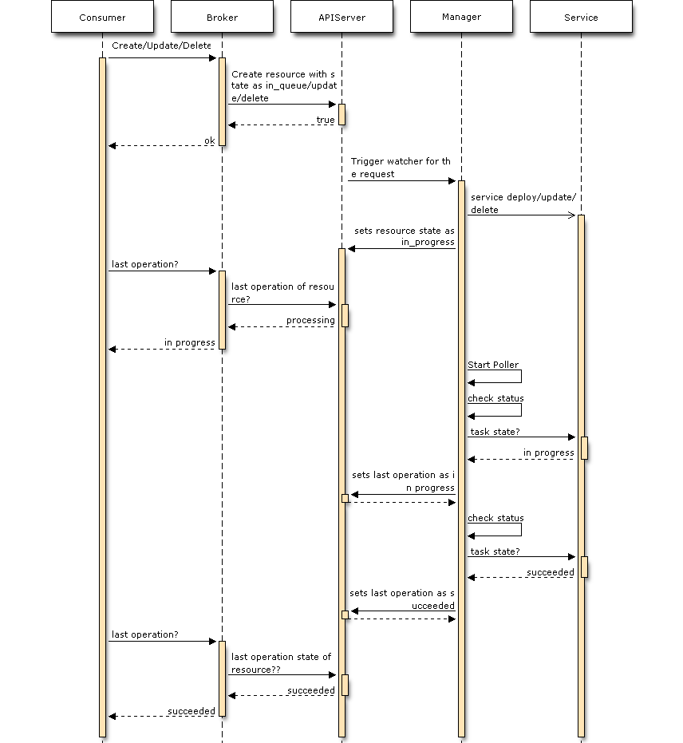
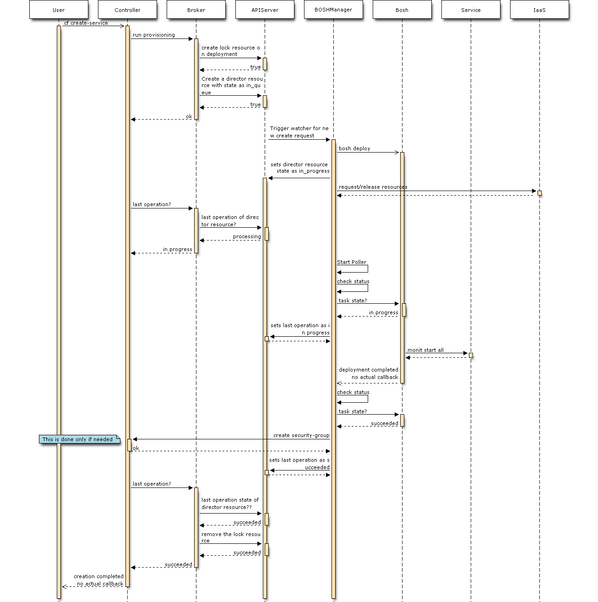
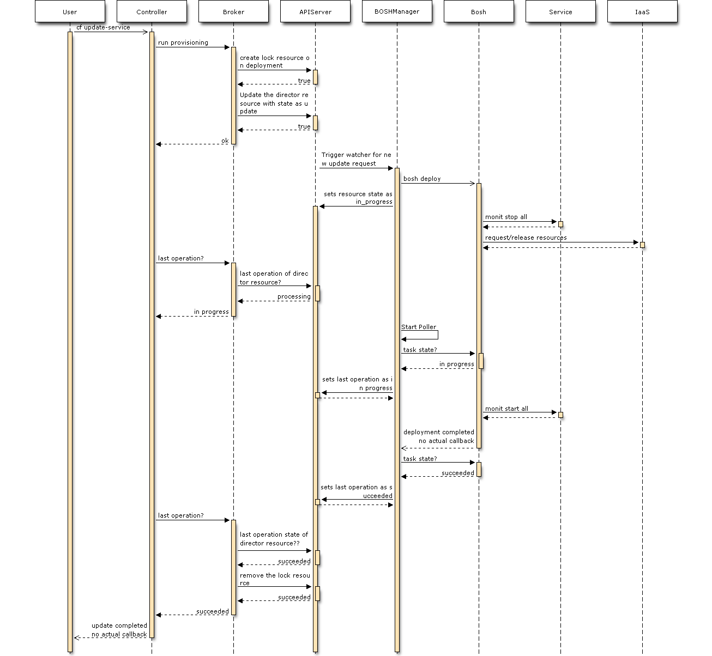
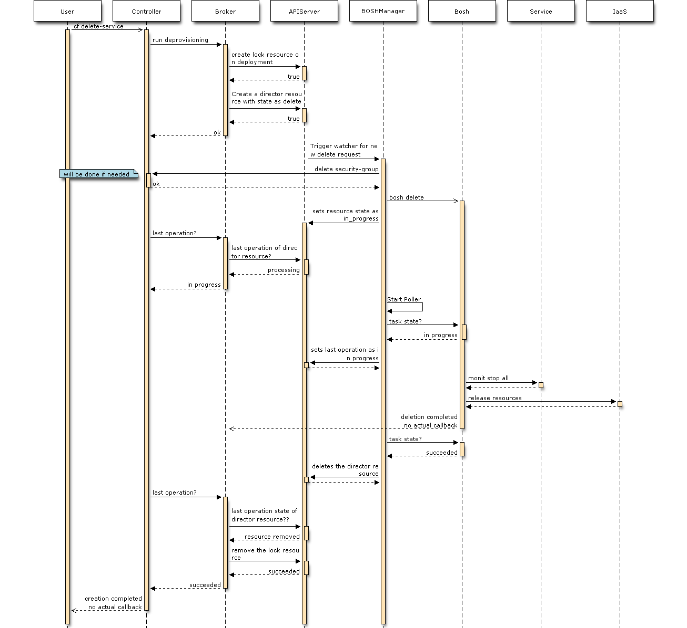
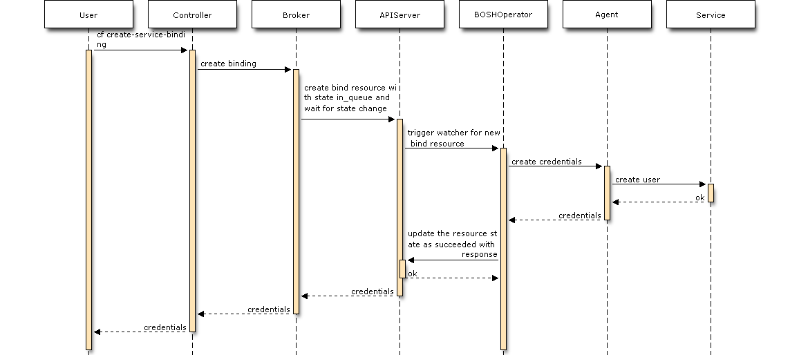
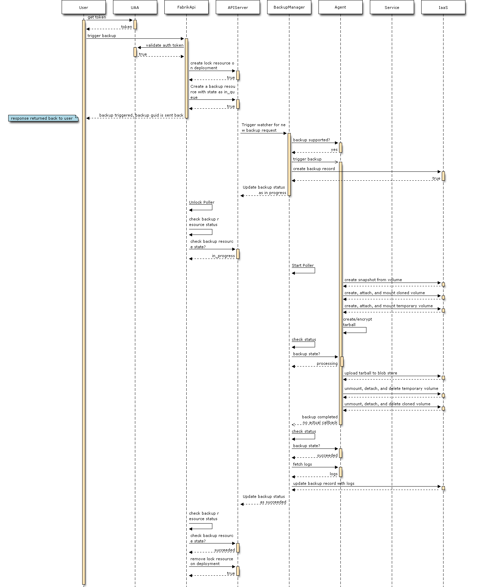
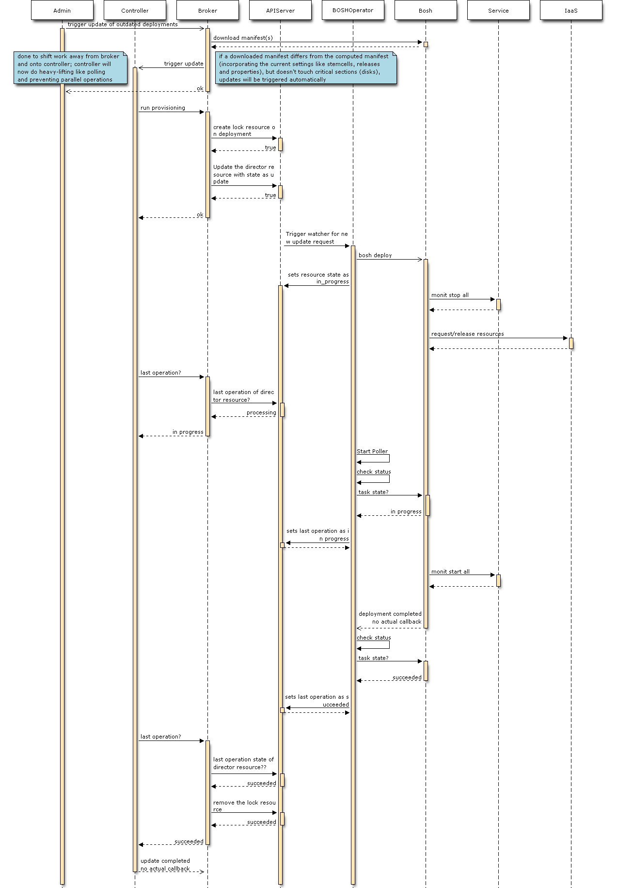
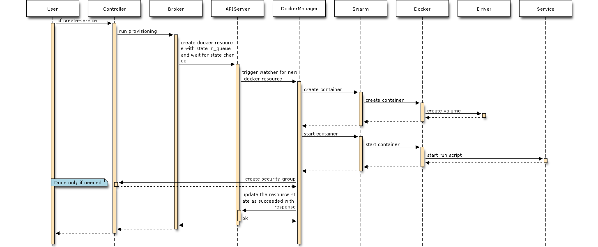
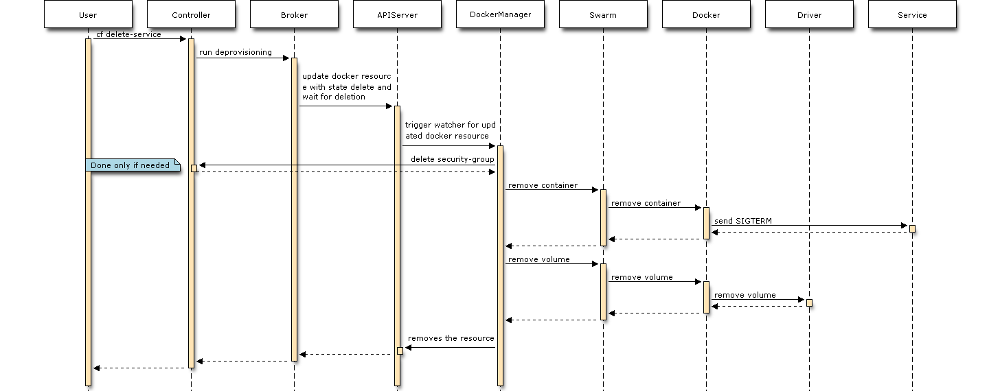

# SF 2.0 Basics #

# BOSH Based Services #
# SF2.0-service-instance-bosh-provisioning #

# SF2.0-service-instance-bosh-update #

# SF2.0-service-instance-bosh-deprovisioning #

# SF2.0-service-binding-creation #

# SF2.0-service-binding-deletion #

# SF2.0-service-instance-bosh-backup-online #

# SF2.0-service-instance-bosh-update-automated #

# Docker Based Services #
# SF2.0-service-instance-docker-provisioning #

# SF2.0-service-instance-docker-deprovisioning #

